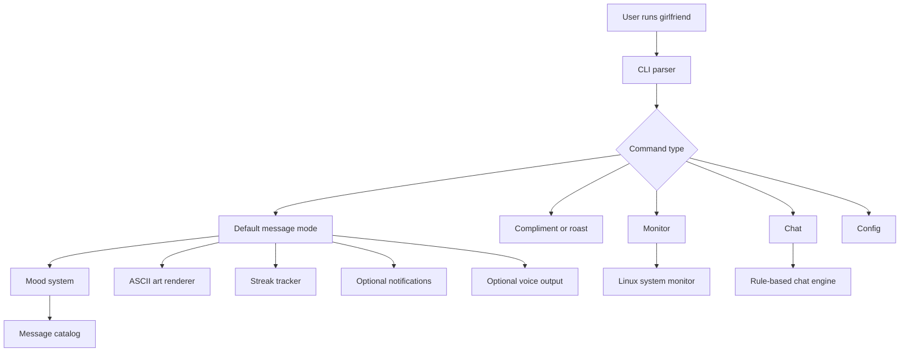
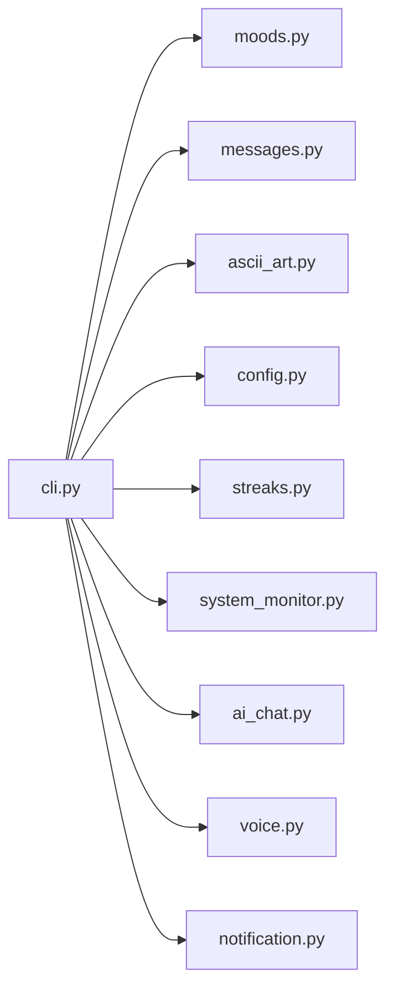
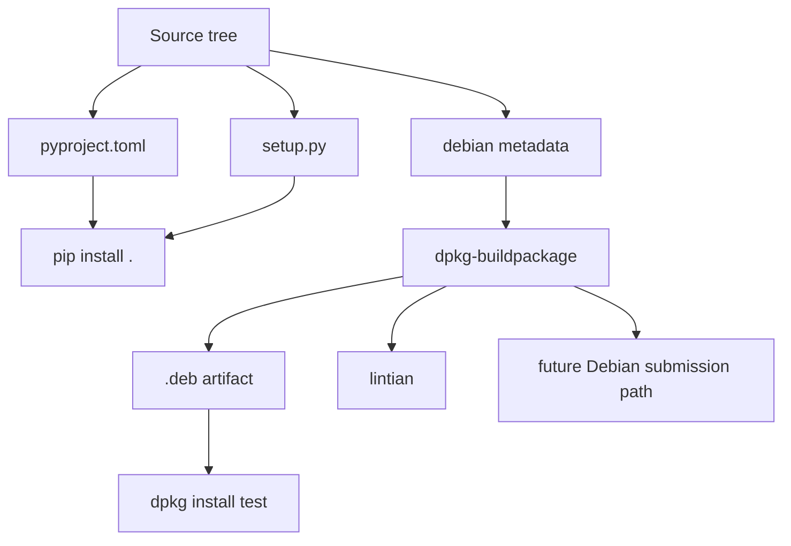

# girlfriend

`girlfriend` is a terminal-native virtual girlfriend assistant for Linux users. It is designed to be cute, funny, nerdy, local-first, and easy to package as a real command-line application for Debian-based systems.

It prints romantic one-liners, mood-based reactions, system-monitor jokes, voice output, ASCII art, streak tracking, and lightweight chat with local replies plus Gemini fallback, all from the Linux terminal.

## Why This Project Exists

Most terminal tools are serious. `girlfriend` is intentionally not.

This project blends:

- CLI humor
- Linux culture
- playful companionship
- offline-friendly Python packaging
- Debian-style distribution goals

The result is a meme-worthy terminal app that still tries to behave like a professional open-source package.

## Highlights

- Offline-first CLI companion
- Mood-based personality system
- Random romantic messages and nerdy compliments
- Harmless Linux-user roast mode
- Streak tracking and local user stats
- System monitor commentary for CPU, RAM, disk, battery, and distro
- Desktop notifications via `notify-send`
- Voice output via `espeak` or `espeak-ng`
- Softer feminine offline voice presets such as `cute`, `soft`, and `anime`
- Local-first chat mode with Gemini fallback
- Rich terminal UI with ASCII branding
- Python packaging for `pip install .`
- Debian packaging metadata for `.deb` builds
- Long-term path toward official APT packaging

## Feature Overview

| Feature | Description |
| --- | --- |
| Default mode | Prints a random romantic or funny message |
| Moods | `caring`, `jealous`, `hacker`, `clingy`, `sleepy`, `gamer`, `motivational` |
| Mood art | Shows terminal-friendly mood art inside the main header |
| Compliment mode | Prints nerdy, affectionate one-liners |
| Roast mode | Gentle Linux-user roasts |
| Streaks | Tracks daily usage in `~/.girlfriend/` |
| Stats | Shows streak, interactions, and config path |
| Monitor | Reads Linux system signals and reacts to them |
| Notifications | Sends desktop popups if `notify-send` exists |
| Voice | Speaks responses using local offline TTS |
| Chat | Rule-based local conversation mode |
| Config | Stores preferences such as mood, voice, and theme |

## Sample Output

```text
╭───────────────────────────── girlfriend v3.0.0 ──────────────────────────────╮
│                                                                              │
│  ██████╗ ██╗██████╗ ██╗     ███████╗██████╗ ██╗███████╗███╗   ██╗██████╗     │
│  ██╔════╝ ██║██╔══██╗██║     ██╔════╝██╔══██╗██║██╔════╝████╗  ██║██╔══██╗   │
│  ██║  ███╗██║██████╔╝██║     █████╗  ██████╔╝██║█████╗  ██╔██╗ ██║██║  ██║   │
│  ██║   ██║██║██╔══██╗██║     ██╔══╝  ██╔══██╗██║██╔══╝  ██║╚██╗██║██║  ██║   │
│  ╚██████╔╝██║██║  ██║███████╗██║     ██║  ██║██║███████╗██║ ╚████║██████╔╝   │
│   ╚═════╝ ╚═╝╚═╝  ╚═╝╚══════╝╚═╝     ╚═╝  ╚═╝╚═╝╚══════╝╚═╝  ╚═══╝╚═════╝    │
│                                                                              │
│  💕 Welcome back, handsome.                                                  │
│  Type 'girlfriend --help' for commands.                                      │
│                                                                              │
│  ╭───────────────────────────── Now Playing ──────────────────────────────╮  │
│  │  💕 You are the sudo to my heart.                                     │  │
│  ╰───────────────────────────── caring mode ──────────────────────────────╯  │
│                                                                              │
│  mood: caring • theme: wholesome • operator: ben                            │
│                                                                              │
╰──────────────────────── please be nice to yourself ──────────────────────────╯
streak: 4 day(s) • total chats: 29
```

## Quick Start

### Run directly from source

```bash
python3 -m girlfriend.cli --help
python3 -m girlfriend.cli --no-typing
python3 -m girlfriend.cli compliment
python3 -m girlfriend.cli monitor
```

### Install locally with pip

```bash
python3 -m venv .venv
source .venv/bin/activate
pip install --upgrade pip
pip install .
girlfriend --help
```

### Build a Debian package

```bash
sudo apt update
sudo apt install -y debhelper-compat dh-python python3-all python3-setuptools python3-rich
dpkg-buildpackage -us -uc -b
sudo dpkg -i ../girlfriend_3.0.0-1_all.deb
```

## Installation Matrix

| Method | Command | Best For |
| --- | --- | --- |
| Source run | `python3 -m girlfriend.cli` | development and quick testing |
| Local pip install | `pip install .` | personal use |
| System-wide pip install | `sudo pip3 install .` | quick global access on non-production systems |
| Debian package | `dpkg-buildpackage -us -uc -b` | packaging and distro-style installs |

## Usage

### Core commands

```bash
girlfriend
girlfriend --mood hacker
girlfriend --quote
girlfriend compliment
girlfriend roast
girlfriend streak
girlfriend stats
girlfriend monitor
girlfriend speak
girlfriend chat
girlfriend chat --config
girlfriend notify-test
```

### Configuration commands

```bash
girlfriend config --set-name ben
girlfriend config --set-mood gamer
girlfriend config --set-theme cozy
girlfriend config --enable-voice
girlfriend config --set-voice-profile cute
girlfriend config --set-voice-rate 145
girlfriend config --set-voice-pitch 72
```

### AI chat setup

Get a free Gemini API key from:

```text
https://aistudio.google.com/app/apikey
```

Then configure chat interactively:

```bash
girlfriend chat --config
```

The interactive setup lets you configure:

- Gemini API key
- Chat mood
- Chat theme
- Response style

The Gemini API key is stored in:

```text
~/.girlfriend/config.json
```

## Mood System

| Mood | Style |
| --- | --- |
| `caring` | sweet, gentle, supportive |
| `jealous` | fake possessive, playful, dramatic |
| `hacker` | nerdy, shell-themed, witty |
| `clingy` | needy, attached, affectionate |
| `sleepy` | bedtime reminders and eepy chaos |
| `gamer` | co-op energy and competitive jokes |
| `motivational` | encouraging, resilient, supportive |

## Voice Profiles

| Voice Profile | Sound Direction |
| --- | --- |
| `cute` | softer feminine default |
| `soft` | calmer and gentler |
| `anime` | brighter and more playful |
| `goth` | lower and moodier |
| `narrator` | more neutral and clear |

Recommended voice setup:

```bash
girlfriend config --enable-voice --set-voice-profile cute --set-voice-rate 145 --set-voice-pitch 72
girlfriend speak
```

## Configuration

Runtime data is stored in:

```text
~/.girlfriend/
```

Primary config file:

```text
~/.girlfriend/config.json
```

Example configuration:

```json
{
  "bedtime_hour": 23,
  "chat_mood": "caring",
  "chat_response_style": "compact",
  "chat_theme": "wholesome",
  "enable_voice": false,
  "gemini_api_key": "",
  "notification_frequency_minutes": 180,
  "preferred_mood": "caring",
  "theme": "wholesome",
  "typing_animation": true,
  "voice_pitch": 68,
  "voice_profile": "cute",
  "voice_rate": 150,
  "username": "ben"
}
```

### Chat behavior

- Simple or familiar prompts stay local and offline.
- Complex prompts fall back to Gemini automatically when they are not handled locally.
- Gemini request usage is not rate-limited by the app when you use your own API key.
- If Gemini is unavailable, the app now explains whether the issue is a missing key, invalid key, quota, no internet, or a Gemini API outage.

## Architecture

### Runtime flow



### Module layout



### Packaging flow



## Repository Layout

```text
girlfriend/
├── girlfriend/
│   ├── __init__.py
│   ├── ai_chat.py
│   ├── ascii_art.py
│   ├── cli.py
│   ├── config.py
│   ├── messages.py
│   ├── moods.py
│   ├── notification.py
│   ├── streaks.py
│   ├── system_monitor.py
│   └── voice.py
├── assets/
├── debian/
├── screenshots/
├── tests/
├── build.md
├── TEST.md
├── LICENSE
├── pyproject.toml
├── README.md
├── requirements.txt
└── setup.py
```

## Testing

### Unit tests

```bash
python3 -m unittest discover -s tests -v
```

### CLI smoke tests

```bash
python3 -m girlfriend.cli --help
python3 -m girlfriend.cli --no-typing
python3 -m girlfriend.cli --mood sleepy --no-typing
python3 -m girlfriend.cli monitor
python3 -m girlfriend.cli config
```

### Dedicated guides

- [TEST.md](TEST.md) for full testing workflow
- [build.md](build.md) for Debian and official repository readiness steps

## Debian Packaging Notes

This repository includes Debian packaging metadata under `debian/`.

Build package:

```bash
dpkg-buildpackage -us -uc -b
```

Install generated package:

```bash
sudo dpkg -i ../girlfriend_3.0.0-1_all.deb
sudo apt -f install
```

Run packaging checks:

```bash
lintian -i -I --pedantic ../girlfriend_3.0.0-1_all.deb
```

## Roadmap

### Near term

- Debian man page
- Debian autopkgtests
- cleaner `lintian` output
- package metadata polish

### Medium term

- better offline voice quality
- richer chat rules
- more themes and reaction packs
- scheduled reminder mode

### Long term

- Ollama integration
- OpenAI API integration
- smarter Gemini prompt styles
- plugin-style personality packs
- true distro submission readiness

## Screenshots

Suggested release screenshots:

- `screenshots/default.png`
- `screenshots/monitor.png`
- `screenshots/chat.png`

## Contributing

Contributions should keep the project:

- funny but non-explicit
- Linux-native
- modular
- offline-friendly
- packaging-conscious

Recommended workflow:

1. Fork the repository.
2. Create a feature branch.
3. Run tests locally.
4. Keep packaging files in sync when behavior changes.
5. Open a pull request with a clear summary.

## Maintainer Notes

This project aims to sit in the unusual intersection of:

- joke software
- terminal UX
- Python packaging
- Debian packaging discipline

That means polish matters. Even when the app is silly, the repository should stay clean, testable, and distribution-friendly.

## License

Released under the MIT License. See [LICENSE](LICENSE).

Copyright (c) 2026 Ben.
